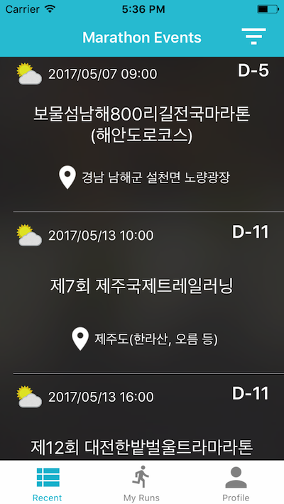
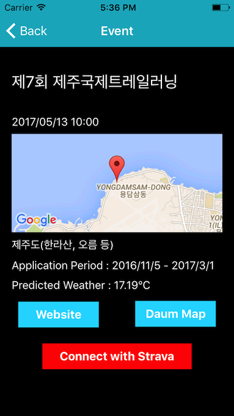

# iRunSeoul

#### How to run code

Simply install the pods and open
the .xcworkspace file to see the project in Xcode.

```
$ pod install
$ open your-iRunSeoul.xcworkspace
```
Create a Firebase project on the [Firebase console](https://console.firebase.google.com).

Use the bundleID from the Xcode project.
Download the generated `GoogleService-Info.plist` file, and copy it to the root
directory of the app in iRunSeoul folder.

This app uses Strava API. Visit [Strava Labs](http://labs.strava.com/developers/) and register your app.
Get Client ID and Secret. We have provided a mock Info plist file in `mocks/Strava-Info.plist`. 
Replace with the values you got from Strava and copy this file to `iRunSeoul` folder.

#### TO-DO
- Add Statistics in Profile
- Add Push Notifications


#### Helpful Links

- [Firebase databse iOS](https://firebase.google.com/docs/database/ios/retrieve-data)
- [Firebase Samples](https://firebase.google.com/docs/samples/)

#### Screenshots

Marathon Events



Detail Event



#### Contributors

- [Sujin Lee](https://github.com/sujinleeme)
- [KoreaMarathonAPI](https://github.com/sujinleeme/KoreaMarathonAPI) made by Sujin Lee